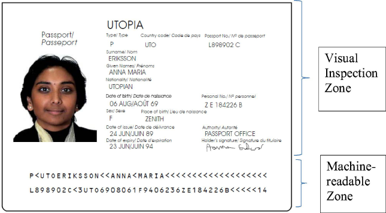
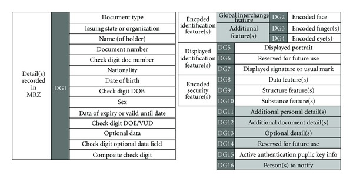
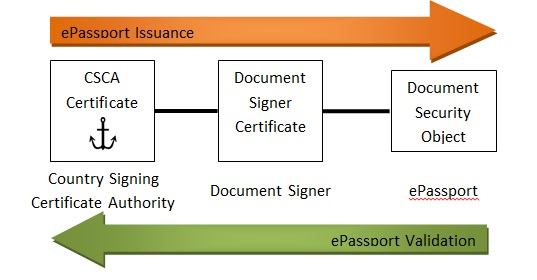

# The Passport Spec

Rarimo relies on passports adhering to the ICAO Machine Readable Travel Documents standard, with each passport containing a Machine-Readable Zone (MRZ):

The MRZ has an RFID chip which contains a set of Data Groups (DG) as follows:

Of note is DG15, the _Active Authentication Public Key_. The passport chip contains a private key that cannot be read or copied but can be used to sign challenges sent to the passport, which in turn can be checked against this public key as an anti-cloning measure. *Do note that the existence of this public key on its own is **not** the anti-cloning measure*.

Furthermore, the chip contains a file known as a Document Security Object (DSO), where hash values of all the other DGs and a digital signature of the hashes are stored. The DSO can then be checked against a Document Signer Certificate (DSC), which may reside on the chip or has to be retrieved from the Issuing Authority, then the DSC has to be checked against the Country Signing Certificate Authority (CSCA) (to be retrieved from the issuing authority) and then checked against the Certificate Revocation List (CRL) to check for continued validity. Wow!

This is the chain of trust which we rely on to ensure that the contents of the passport are valid.

Using Basic Access Control (BAC), an encrypted version of the passport data can be pulled from the RFID chip, then decoded using data derived from the MRZ itself.  

By virtue of relying on biometric passports, this means that Rarimo isn't applicable for citizens of:
- Vietnam
- Egypt
- India
- Pakistan
- El Salvador
- Most of Africa, actually
- South Africa
- A good chunk of the Middle East
- _People who can't afford to get a passport_

We'll highlight whatever issues we spot along the way as we look through the technical implementation.

# Deriving and Storing The Profile

We'll go through it step-by-step as described in the docs:
1. User generates a keypair `<sk, pk>` 
2. User signs `pk` via passport active authentication by using `pk` as a challenge, generating `sig = sign(Hash(pk)[:64], sk_pass)`
	1. If you _do_ do this, the biggest issue with it (and part of the whole premise this protocol is built upon anyways) is that _this challenge signing requires zero further authentication whatsoever_. There is no checking of biometrics against the passport data or whatnot, _if you have **anybody's** passport, you can generate this signature_. Quite obviously the biggest pitfall is that if you steal someone's passport/have your passport stolen, _then too bad_. 
	2. Also, not all passports have active authentication! In this scenario, it's at least [implied in the README here](https://github.com/rarimo/passport-zk-circuits/) that they will instead use a Poseidon hash of the SHA256 hash of a subset of the signed attributes. In theory, I could clone a passport and just have active authentication disabled and force the fallback, essentially bypassing this measure. The [docs](https://docs.rarimo.com/accounts/zk-passport/#challenges-and-limitations) however juts say that those passports would be unsupported.
3. A ZKP `reg_proof` is generated that proves the passport public key belongs to the passport
	1. The docs say this proof shows that the passport public key "is signed by a key from the ICAO list, without revealing the exact passport's issuer". But the passport public key isn't signed by them? I'm assuming it's the signed version of the hash of the public key found in the DSO they're talking about.
4. The circuit calculates a commitment `DG_commit = Hash(DG1 || Hash(sk))`
5. The user submits `<pk, passport public key, sig, reg_proof>` to the smart contract.
6. Upon submission, the generated public key `pk` and the passport public key (which we shall denote as `pk_pass`) are saved in a Sparse Merkle Tree
	1. Sparse Merkle Trees differ from regular Merkle Trees by the existence of null values as leaves, allowing you to place a leaf at a chosen location "arbitrarily", allowing you to form a sort of key-value pair in a Merkle Tree
	2. In this case, the key is the hash of the public keys combined, while the value is the hash of its position combined with `DG_commit`
	3. The utility of these hash "commitments" is that they can only be derived from the values that make it up (duh) without disclosing those values themselves, so we are able to prove the existence of this passport being registered in the Sparse Merkle Tree and that we have the corresponding secret key (as `sk` is part of the `DG_commit`)

# Limitations

As previously stated, with this current implementation it's a given that:
- Non-biometric passports (so passports that are all paper still) will not be applicable to be onboarded
- Passports which do not have Active Authentication enabled are also ineligible
- There are no protections against stolen passports or freshly issued fake passports from being used in this system, especially because a core aspect of how passports even _function_ (the ability to match one's face to the face on the passport, take a scan of their fingerprints) is absent from this system
	- Possibilities: rogue customs officer can register people for this without their consent, someone could do a "passport skim" by scanning the chip via NFC without your consent, undemocratic state issues a fuckload of fake passports with fake issuing and expiry dates, etc.
	- It would be extremely non-trivial to be able to, say, leverage the fingerprint scanner on a phone or something as the "authentication"
- If you own multiple valid passports, you can basically "self Sybil". I suppose Rarimo can then require the hash of some identifying information that would be invariant across the passports and then check against all existing entries, but then it would 1) violate their whole "privacy preserving social graph" thing since it would require _you being able to ID entries_ and 2) would likely be near impossible to implement due to all the possible fringe cases

These by far are the most glaring issues with the idea of using passports as this sort of proof-of-humanity altogether. But we press on, and look at how they apply ZKPs to this...

# ZKPs on the Passport

Rarimo makes use of a framework called [circom](https://github.com/iden3/circom) to construct their ZKP circuits, brought over to the ETH ecosystem with [Hardhat-zkit](https://github.com/dl-solarity/hardhat-zkit). As for the validity and safety of these circuits, Rarimo has undergone [audits](https://docs.rarimo.com/resources/audits/) by Halborn and Ambisafe, so we shall, well, trust their word on it.

This bit is surprisingly straightforward, assuming the entire system works as intended:
- The authentication part is by comparing against the Sparse Merkle Tree as previously mentioned. It relies on the user possessing the secret key generated when registering and the whole DG1 data block, which is basically all the readable data found in the MRZ, with these being passed in to a ZK circuit alongside the Merkle tree root to prove both existence of it being in the tree itself and that the hashed values match up
- Following authentication, we then have the selective data reveal circuit. There's a bunch of parameters, but basically it requires the DG1 (MRZ with your birthday, expiration date, name, nationality, citizenship, sex and document number all present) and DG15 (the active authentication public key) sections part of the private inputs, then some query (what data to reveal, the bounds of the birthday and expiration date, etc.), with the outputs being as requested from the query

This _seems_ like a complicated black magic ZK circuit, but in all actuality these are very much doable, especially since you've got basic operations in play (AND selected bits by 1 to reveal, 0 them otherwise. Checking if a value is within bounds is also trivially achievable with logic gates — its our prototypical ZKP example after all)