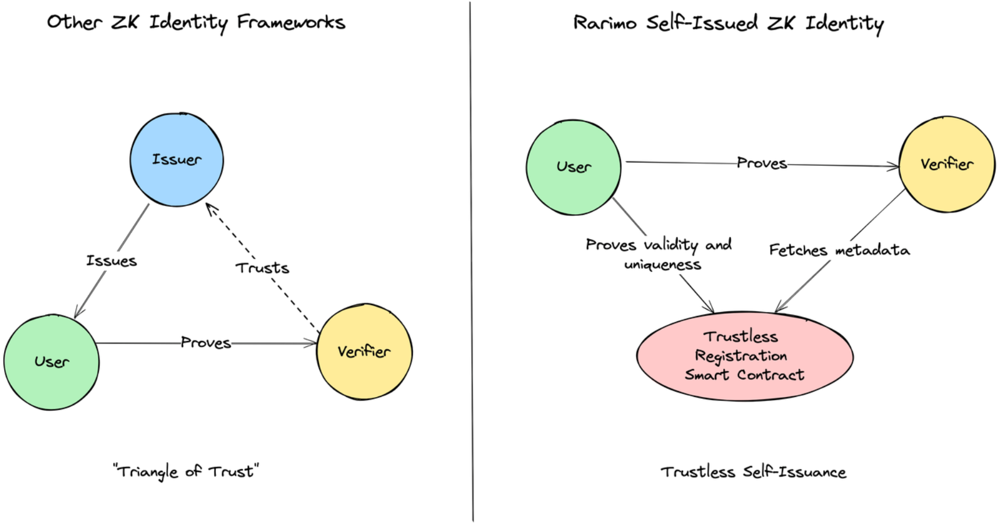
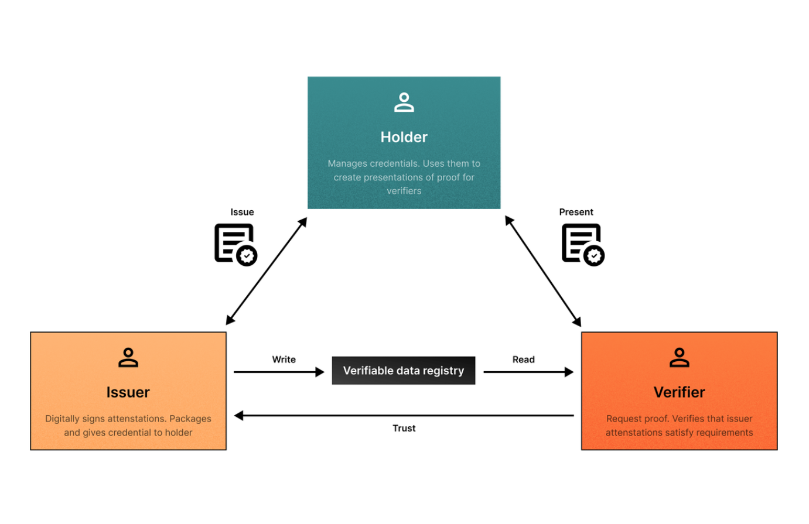
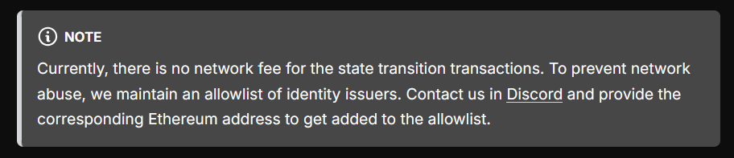
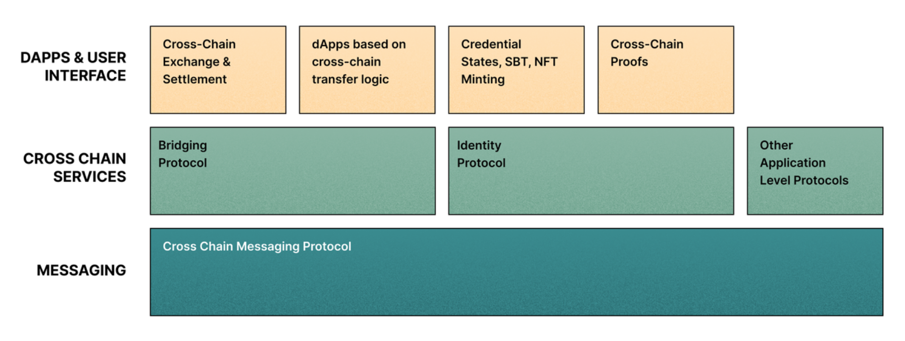
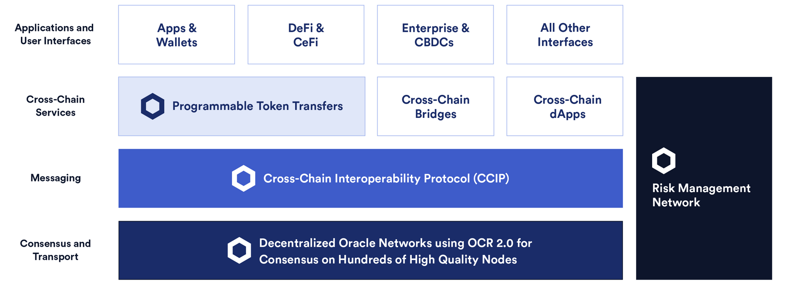

This is the part where it gets much messier. From what we've seen so far, Rarimo has essentially proposed a smart contract which we can "register" passports with and a set of ZK circuits to prove our ownership of said passports (with various caveats), which is all fine and dandy and makes for great utility on its own. However, this is the Rarimo _Protocol_, so there's supposed to be more to it...

# Identity Provider

In the docs, the discussion of [credential trees](https://docs.rarimo.com/credential-trees/) are brought up, which are basically the Sparse Merkle Trees we've been talking about this whole time. However, we then have the proposal of an... identity provider? Wait, haven't we been talking about _trustless self-issuance_ this entire time? Why are we suddenly talking about identity providers?

This is literally what we saw earlier that shows how Rarimo is different from other frameworks:

And this is the diagram they put in this part of the docs:

To quote: "The Rarimo Identity Protocol doesn't gatekeep the credential issuance and instead embraces the Triangle of Trust between the issuer, holder, and verifier."

So despite giving us a means to perform trustless self-issuance, Rarimo still wants to provide a primitive for creating a classical "triangle of trust" credential issuing system...

Ironically, Rarimo just straight gatekeeps who is allowed to be an identity issuer:

I won't even bother going into the technical details of this because it's essentially creating more Sparse Merkle Trees but with different credential specs from the passport example that we've been seeing thus far.

As for ZKP verification with these arbitrary identity specs, it's accomplished through another set of smart contracts that support [Iden3 proof queries](https://docs.iden3.io/protocol/querylanguage/). What is amusing here is that Iden3 seems to be a protocol... entirely based around creating identity issuing entities to add to Merkle Trees, verifiable by ZKPs. 

This aspect of the Rarimo Protocol is very much just building off existing work by Iden3 (and this is [explicitly stated](https://docs.rarimo.com/credential-trees/smart-contracts-reference/)), so... yipee for the open source I suppose.

# RariMe

With the technical details of all the passport ingestion stuff earlier on, the way this is implemented proper for users is through the RariMe app, where most of the passport scanning NFC logic lives. RariMe is also what enables the storing of other Rarimo related identities issued as described above, so there really isn't much to talk about here since it very much is basically Just A Wallet App for all these Rarimo identities.

# Rarimo Core

This is where the protocol part seems to really come in. Rarimo Core is meant to be an interoperability layer to allow for "identity state replication" as mentioned in the first part of this writeup. It's built on Cosmos + Tendermint (which we can see on their [GitHub](https://github.com/rarimo/rarimo-core)) and already has a live mainnet with a grand total of [9 validators](https://scan.rarimo.com/validators?limit=10&offset=0&status=0).  

It's said to offer a ready-to-use "identity sub-protocol", which is just the Sparse Merkle Tree stuff we've repeatedly several times over already.

What Rarimo is proposing here is a Oracle + Validator based means of performing cross-chain communication, in particular for issued identities on various chains. In brief, you have a set of validators that oversee oracles, requiring a threshold signature to validate transactions and a standard PoS system where you stake RMO tokens.

I've cut out a massive portion of the writeup here because something obvious that was staring me down in the face was finally recognised.

Instead of going into the specifics of their proposed tokenomics for the RMO tokens or reiterating what we've seen countless times before when it comes to threshold signatures and oracle based systems, I instead draw you to the following diagrams:

Similar, isn't it?

We've stumbled onto yet another case of reinventing the wheel: we've made Chainlink. Again. Except now primarily focused on "identity provider" contracts on different chains.

_Do we need this?_ Is the oracle based system even the optimal solution for cross-chain communication in this case?

